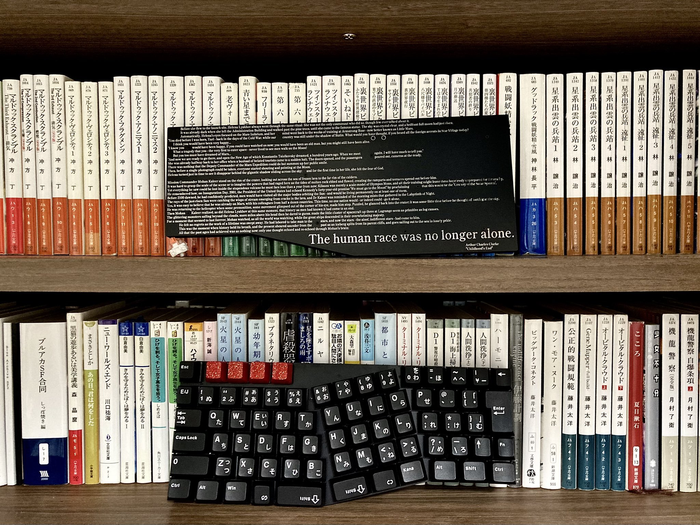

Build guide for Childhood's End  
「幼年期の終わり」ビルドガイド
----------------------------
Half-Alice style keyboard

# 設計思想
幼年期の終わり(Childhood's End)は、ノートパソコンの筐体中央とホームポジションが揃っていないという問題点を解決しつつ、コンパクトに使えるキーボードとして設計されました。  
本キーボードの特徴は右手クラスタの傾斜配置、およびJIS配列にあります。  
  
キーを傾斜させる配置では左右対称に近いデザインにすることが多い一方、本キーボードは右手側だけを大きく傾斜させています。  
これにより、左手をまっすぐ、右手を斜めに置いて打鍵する左右非対称の姿勢でも打ちやすい独特の使い心地が生まれます。  
  
また、日本語入力にはほぼ必須ともいえる全角半角キー、変換無変換や片仮名ひらがなローマ字といったキーも詰め込まれています。  
自作キーボードの世界では数少ない片側のみの傾斜配置、JIS配列を組み合わせた特徴的なキーボードをお楽しみください。

# ビルドガイド

## 作業前の準備
### 内容物の確認
 - 基板
 - スイッチプレート
 - バックプレート(ケースレスバージョンのみ)
 - スペーサー(ケースレスバージョンのみ)
 - 筐体(ケースバージョンのみ)
 - ネジ
 - ゴム足
### その他必須パーツの用意
 - ATmega32U4版 Pro Micro 1個 ※「Pro Microの選定・動作確認」参照
 - 2mm/12pinコンスルー 2本
 - Cherry MX互換キースイッチ 72個
 - MX軸キーキャップ JIS配列推奨 ※「キーキャップの選定」参照
 - タクトスイッチ 1個
 - Kailh MXキーソケット 72個
 - ダイオード 72個
 - MX用 2Uスタビライザー 2~3個 ※「キーキャップの選定」参照
### その他必要パーツの用意※必須ではない
 - LED SK6812MINI-E
### 工具類
 - 温調はんだごて
 - はんだ
 - フラックス
 - 六角レンチ
 - Pro Microに対応する通信用ケーブル
  
## キーキャップの選定
以下の条件を満たすJIS配列用のセットであればほぼ全てのキーをカバーできます。  
 - 60%以上のセット
 - Stepped Caps Lock
 - 1U 無変換
 - 1.25U 変換
 - 1.25U かな

  
右ShiftおよびFnは1U @R2が必要です。テンキーや矢印キーを使用してください。  
分割Spaceは2U @R1と1.5U @R1を使用します。上下反対に差し込むことをお勧めします。
左Shiftは、後述のスタビライザーを導入の上で2U @R2のキーキャップを使用するか、スタビライザーを取り付けずに右Shift(1.75U @R2)のキャップを移植してください。  
左Shiftキーに1.75Uキーキャップを使用する場合は必要なスタビライザーの合計数は2個、2Uを使用する場合は3個となります。

[具体的なキー幅はKLEでも確認できます。](http://www.keyboard-layout-editor.com/##@@_y:2&x:2%3B&=%0AEsc&_x:0.5%3B&=%0AIns&=%0APrint&=%0AScLk&=%0APause&_x:5.75%3B&=%0A%2F=-&=%0A~%5E&=%0A%7C%5C&=%0ABS%3B&@_x:12.75%3B&=%0AP&=%0A%60%2F@&=%0A%7B%5B&_x:0.25&w:1.25&h:2&w2:1.5&h2:1&x2:-0.25%3B&=%0AEnter%0A%0A%0A%0A%0A%0A%0A%0AISO%3B&@_y:-0.75&x:2%3B&=%0A%E5%8D%8A%2F%2F%E5%85%A8&=%0A1&=%0A2&=%0A3&=%0A4&=%0A5%3B&@_y:-0.25&x:13%3B&=%0A%2F%3B+&=%0A%2F:&=%0A%7D%5D%3B&@_y:-0.75&x:2&w:1.5%3B&=%0ATab%0A%0A%0A%0A%0A%0A%0A%0A1.5&=%0AQ&=%0AW&=%0AE&=%0AR&=%0AT%3B&@_y:-0.25&x:13.25%3B&=%0A%3F%2F%2F&=%0A%2F_%5C&=%0AShiftR&=%0AFn%3B&@_y:-0.75&x:2&w:1.5&w2:1.75&l:true%3B&=%0ACaps%20Lock%0A%0A%0A%0A%0A%0A%0A%0A1.75%20Step&_x:0.25%3B&=%0AA&=%0AS&=%0AD&=%0AF%0A%0A%0A%0A%0A%0A%0A%0A%0A%2F_&=%0AG%3B&@_y:-0.25&x:13.25&w:1.25%3B&=%0AAltR%0A%0A%0A%0A%0A%0A%0A%0A1.25&_w:1.25%3B&=%0AMenu%0A%0A%0A%0A%0A%0A%0A%0A1.25&_w:1.5%3B&=%0ACtrlR%0A%0A%0A%0A%0A%0A%0A%0A1.5%3B&@_y:-0.75&x:2&w:2%3B&=%0AShiftL%0A%0A%0A%0A%0A%0A%0A%0A2&=%0AZ&=%0AX&=%0AC&=%0AV&=%0AB%3B&@_x:2&w:1.5%3B&=%0ACtrlL%0A%0A%0A%0A%0A%0A%0A%0A1.5&_w:1.25%3B&=%0AWin%0A%0A%0A%0A%0A%0A%0A%0A1.25&_w:1.25%3B&=%0AAltL%0A%0A%0A%0A%0A%0A%0A%0A1.25&=%0A%E7%84%A1%E5%A4%89%E6%8F%9B&_a:7&w:2%3B&=2%3B&@_rx:12&ry:4.75&y:-2.75&x:0.25&a:4%3B&=%0A0%3B&@_r:-14.4&y:-0.75&x:-3.5%3B&=%0A6&=%0A7&=%0A8&=%0A9%3B&@_x:-3.25%3B&=%0AY&=%0AU&=%0AI&=%0AO%3B&@_x:-3.25%3B&=%0AH&=%0AJ%0A%0A%0A%0A%0A%0A%0A%0A%0A%2F_&=%0AK&=%0AL%3B&@_x:-3.25%3B&=%0AN&=%0AM&=%0A%3C,&=%0A%3E.%3B&@_x:-3.5&a:7&w:1.5%3B&=1.5&_a:4&w:1.25%3B&=%0A%E5%A4%89%E6%8F%9B%0A%0A%0A%0A%0A%0A%0A%0A1.25&_w:1.25%3B&=%0A%E3%82%AB%E3%81%B2%E3%83%AD%0A%0A%0A%0A%0A%0A%0A%0A1.25)

## Pro Microの選定・動作確認
### 選定
ATmega32U4を搭載したPro Micro互換基板であれば基本的に使用可能です。  
類似品としてICチップが異なるRP2040版がありますが、こちらの互換性はないのでご注意ください。  
また、現在のところでは無線化(BLE Micro Pro)をサポートしていません。
  
### 動作確認
現在のところVIAやREMAPなどにはマージされていません。Pro Micro Web Updaterを用いてPro Microにファームウェアを書き込んでください。  
一旦書き込んだらVIAによる編集が可能になります。  

うまくいかない場合

  通信用ケーブルで接続していること、ChromeでUpdaterを開いていることを確認してください。  
  それでも認識しなかったり、書き込めない場合は初期不良かもしれません。

## 部品のはんだづけ
### LEDのはんだづけ(オプション)
表面実装LEDは全て付けるか付けないかの二択になります。  
基板の表示(シルクスクリーン)上のGNDとLEDの足の切り欠きを合わせてはんだづけしていきます。  
後で作業しようとすると大変なので、付けたい場合は最初に付けてください。

### ダイオードのはんだづけ
表面実装・リードタイプどちらもサポートしています。  
向きは全て揃えてあります。シルクスクリーンとダイオードの線を揃えてはんだづけしてください。

### スイッチソケットのはんだづけ
シルクスクリーンとソケットの向きを揃えてはんだづけしてください。  
あまり大量にはんだを流すと端子部だけでなくソケット部にまで流れ込み、押し込みが硬くなってしまったり差し込めなくなってしまうので注意してください。

### タクトスイッチのはんだづけ
頻繁に使うものではありませんが、筐体を分解せずにスイッチを押すために必須となります。  
向きはないので、シルクスクリーンに合わせて差し込み、はんだづけします。

### コンスルーの作業
基板側にコンスルーを刺し、画像のようにPro Microを設置します。
Pro Micro側をはんだづけし、抜き差しできる状態にします。

## 部品の取付け
### スタビライザーの取付け
ワイヤーが露出する部分は基板上に線で表示されています。  
左Shiftに右Shiftのキャップを移植する際は左Shiftのスタビライザーは不要です。

### スイッチの取付け
スイッチプレートを正面から見て、足が上側になるようにスイッチを取り付けます。  
隅の4つを取り付けたら基板に差し込み、残りのスイッチも取り付けていきます。

## 筐体に収める前の確認
スイッチを全て取り付けたらVIA経由でスイッチをテストします。  
認識がおかしいキーがあった場合はスイッチの足が曲がっていないか、スイッチソケットの足ははんだづけされているか、ダイオードの向きは合っているかなどを確認します。  

すべて点灯したら、このキーボードは既に使える状態になっています。

## 筐体への取付け(ケースバージョン)
下筐体にかぶせるように基板を収め、スイッチプレートの穴と筐体に埋め込まれたナットの位置を合わせます。  
付属のネジで固定して、ゴム足を取り付けたら完成です。

## バックパネルの取付け(ケースレスバージョン)
バックパネルにネジとスペーサーを取り付けます。  
この状態でスイッチプレートを乗せてねじ止めし、ゴム足を取り付けたら完成です。

# マッピングガイド
キーマップの書き換えにはVIAを使用します。  
デフォルトで設定されているのはJIS配列を踏襲した配置となっており、通常のJISキーボードからの移行でも違和感なく使用できるはずです。
