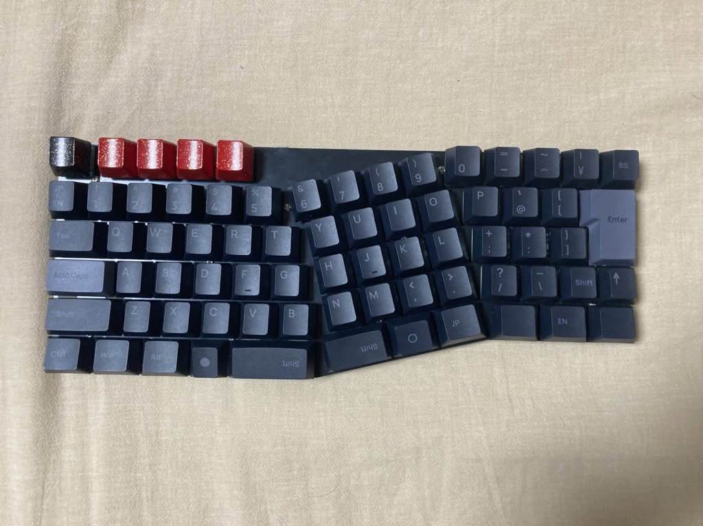

Build guide for Childhood's End  
「幼年期の終わり」ビルドガイド
----------------------------
Half-Alice style keyboard

# 設計思想
幼年期の終わり(Childhood's End)は、ノートパソコンの筐体中央とホームポジションが揃っていないという問題点を解決しつつ、コンパクトに使えるキーボードとして設計されました。  
本キーボードの主な特徴は右手クラスタの傾斜配置とJIS配列にあります。  
  
キーを傾斜させる配置では左右対称に近いデザインにすることが多い一方、本キーボードは右手側だけを大きく傾斜させています。  
これにより、左手をまっすぐ、右手を斜めに置いて打鍵する左右非対称の姿勢でも打ちやすい独特の使い心地が生まれます。  
  
また、日本語入力にはほぼ必須ともいえる全角半角キー、変換無変換や片仮名ひらがなローマ字といったキーも詰め込まれています。  
自作キーボードの世界では数少ない片側のみの傾斜配置、JIS配列を組み合わせた特徴的なキーボードをお楽しみください。

# ビルドガイド

## 作業前の準備
### 内容物の確認
 - 基板  
   1枚入っています。
 - スイッチプレート  
   1枚入っています。
 - バックプレート  
   1枚入っています。  
 - スペーサー  
   4mmオスメス、8mmメスメスが14本ずつ入っています。
 - ネジ  
   28本必要です。少し多めに入っているはずです。
 - ゴム足  
   4枚入っています。
### 必須パーツの用意
 - Pro Micro  
   1個 ※「Pro Microの選定・動作確認」参照
 - ピンソケット  
   2本 3.5mm、13Pin推奨 2.54mmピッチ
 - ピンヘッダ  
   2本 2.5mm、1x12pinまたは1x13pin 2.54mmピッチ ※「Pro Microの選定・動作確認」参照
 - Cherry MX互換キースイッチ
   72個
 - MX軸キーキャップ  
   1セット JIS配列推奨 ※「キーキャップの選定」参照
 - タクトスイッチ  
   1個
 - Kailh MXキーソケット  
   72個
 - ダイオード  
   72個 1N4148 リードまたは表面実装
 - MX用 2Uスタビライザー  
   2~3個 ※「キーキャップの選定」参照
### その他パーツの用意※必須ではない
 - LED
   72個 SK6812MINI-E
### 必須工具類
 - はんだ作業関連品一式
 - 六角レンチ
 - エンドニッパー
 - Pro Microに対応する通信用ケーブル
###推奨工具類
 - キープラー
 - 油性マーカー(黒)
 - マスキングテープ
### 必要ファイルのダウンロード
 - childhood_s_end_via-****.hex
 - childhood_s_end_via-****.json
 - info-****.json
  
## キーキャップの選定
以下の条件を満たすJIS配列用のセットであればほぼ全てのキーをカバーできます。  
 - 60%以上のセット
 - Stepped Caps Lock
 - 1U 無変換
 - 1.25U 変換
 - 1.25U かな

バラ買いしたり、移植する必要があるキーは以下の通りです。
 - 右ShiftおよびFn  
   1U @R2が必要です。テンキーや矢印キー上を使用するか、ブランクを購入してください。  
 - Space  
   左側に2U @R1、右側に1.5U @R1を使用します。2Uの方はテンキーの0が使用可能です。  
 - 左Shift  
   後述のスタビライザーを導入の上で2U @R2のキーキャップを使用するか、スタビライザーを取り付けずに右Shift(1.75U @R2)のキャップを移植してください。  
 
 - 左Shiftキーに1.75Uキーキャップを使用する場合は必要なスタビライザーの合計数は2個、2Uを使用する場合は3個となります。
 - スナップオンタイプ、ねじ止めタイプ、どちらも使用可能です。スイッチプレート実装型のものは使用できません(そもそも流通が少ないのでうっかりでは使わないと思いますが……)

[具体的なキー幅はKLEでも確認できます。](http://www.keyboard-layout-editor.com/##@@_y:2&x:2%3B&=%0AEsc&_x:0.5%3B&=%0AM1&=%0AM2&=%0AM3&=%0AM4&_x:5.75%3B&=%0A%2F=-&=%0A~%5E&=%0A%7C%5C&=%0ABS%3B&@_x:12.75%3B&=%0AP&=%0A%60%2F@&=%0A%7B%5B&_x:0.25&w:1.25&h:2&w2:1.5&h2:1&x2:-0.25%3B&=%0AEnter%0A%0A%0A%0A%0A%0A%0A%0AISO%3B&@_y:-0.75&x:2%3B&=%0A%E5%8D%8A%2F%2F%E5%85%A8&=%0A1&=%0A2&=%0A3&=%0A4&=%0A5%3B&@_y:-0.25&x:13%3B&=%0A%2F%3B+&=%0A%2F:&=%0A%7D%5D%3B&@_y:-0.75&x:2&w:1.5%3B&=%0ATab%0A%0A%0A%0A%0A%0A%0A%0A1.5&=%0AQ&=%0AW&=%0AE&=%0AR&=%0AT%3B&@_y:-0.25&x:13.25%3B&=%0A%3F%2F%2F&=%0A%2F_%5C&=%0AShiftR&=%0AFn%3B&@_y:-0.75&x:2&w:1.5&w2:1.75&l:true%3B&=%0ACaps%20Lock%0A%0A%0A%0A%0A%0A%0A%0A1.75%20Step&_x:0.25%3B&=%0AA&=%0AS&=%0AD&=%0AF%0A%0A%0A%0A%0A%0A%0A%0A%0A%2F_&=%0AG%3B&@_y:-0.25&x:13.25&w:1.25%3B&=%0AAltR%0A%0A%0A%0A%0A%0A%0A%0A1.25&_w:1.25%3B&=%0AMenu%0A%0A%0A%0A%0A%0A%0A%0A1.25&_w:1.5%3B&=%0ACtrlR%0A%0A%0A%0A%0A%0A%0A%0A1.5%3B&@_y:-0.75&x:2&w:2%3B&=%0AShiftL%0A%0A%0A%0A%0A%0A%0A%0A2&=%0AZ&=%0AX&=%0AC&=%0AV&=%0AB%3B&@_x:2&w:1.5%3B&=%0ACtrlL%0A%0A%0A%0A%0A%0A%0A%0A1.5&_w:1.25%3B&=%0AWin%0A%0A%0A%0A%0A%0A%0A%0A1.25&_w:1.25%3B&=%0AAltL%0A%0A%0A%0A%0A%0A%0A%0A1.25&=%0A%E7%84%A1%E5%A4%89%E6%8F%9B&_a:7&w:2%3B&=2%3B&@_rx:12&ry:4.75&y:-2.75&x:0.25&a:4%3B&=%0A0%3B&@_r:-14.4&y:-0.75&x:-3.5%3B&=%0A6&=%0A7&=%0A8&=%0A9%3B&@_x:-3.25%3B&=%0AY&=%0AU&=%0AI&=%0AO%3B&@_x:-3.25%3B&=%0AH&=%0AJ%0A%0A%0A%0A%0A%0A%0A%0A%0A%2F_&=%0AK&=%0AL%3B&@_x:-3.25%3B&=%0AN&=%0AM&=%0A%3C,&=%0A%3E.%3B&@_x:-3.5&a:7&w:1.5%3B&=1.5&_a:4&w:1.25%3B&=%0A%E5%A4%89%E6%8F%9B%0A%0A%0A%0A%0A%0A%0A%0A1.25&_w:1.25%3B&=%0A%E3%82%AB%E3%81%B2%E3%83%AD%0A%0A%0A%0A%0A%0A%0A%0A1.25)

## Pro Microの選定・動作確認
### 選定
ATmega32U4を搭載したPro Micro互換基板であれば基本的に使用可能です。  
類似品としてICチップが異なるRP2040版がありますが、現在のファームウェアに互換性はなく、使用できないのでご注意ください。  
また、現在のところでは無線化(BLE Micro Pro)をサポートしていませんが、将来的に電池ボックス等を実装する可能性があります。

### 部品類
ピンソケット・ピンヘッダが必要です。  
「必須パーツの用意」で書いた通りの仕様であれば問題なく使えるはずです。  
一度組み上げた後のピンソケットの交換は非常に面倒なので、1x13pinを推奨しています。  
ピンヘッダのピン数はPro Microのピン数に合わせてください。
### 動作確認
  
現在のところVIAやReMapなどにはマージされていません。Pro Micro Web Updaterを用いてPro Microにファームウェア(childhood_s_end_via-****.hex)を書き込んでください。  
一旦書き込んだらReMapおよびVIAによる編集が可能になります。  

うまくいかない場合

  通信用ケーブルで接続していること、ChromeでUpdaterを開いていることを確認してください。  
  それでも認識しなかったり、書き込めない場合は初期不良かもしれません。

  
VIAのSave + Load > Load Saved Layout からchildhood_s_end_via-****.jsonを読み込みます。
これでファームウェアとキーマップの両方がロードされた状態になりました。

## ファイルの確認
ファイル名末尾の **** の部分はバージョン情報です。基本的に最新のものを使用してください。  
全て本リポジトリ内の/Firm/Ver-****/以下で入手できます。
### childhood_s_end_via-****.hex
キーボードを制御するためのファームウェアです。
### childhood_s_end_via-****.json
VIA用の初期キーマップ定義用ファイルです。ファームウェアだけではキーマップが崩れてしまうことがあるため、VIA経由で定義し直す用です。
### info-****.json
キーマトリクス定義用ファイルです。VIAやReMapでキーマップを書き換える度に使用します。

## はんだ前の作業
### 時間の確保
ここから先は大量のパーツをはんだづけすることになります。  
途中で休憩もできますが、一度にやってしまうのが楽でしょう。

### 基板端の処理(任意)
基板の端(断面)を油性マーカーで塗ると綺麗に見えます。

## 部品のはんだづけ
### LEDのはんだづけ(オプション)
  
表面実装LEDは全て付けるか付けないかの二択になります。  
LEDの発光面を表側に向け、基板の表示(シルクスクリーン)上のGNDとLEDの足の切り欠きを合わせてはんだづけしていきます。  
後で作業しようとすると大変なので、付けたい場合は最初に付けてください。  
  
融点200℃未満の有鉛はんだを使うのがお勧めです。煙を吸わないよう換気・送風を行ってください。  

### ダイオードのはんだづけ
  
1N4148シリーズの使用を想定しています。表面実装、リード、どちらでも問題ありません。  
向きは基本的に左向きに揃えてあります。D1、D2、D30のみ下向きです。  
シルクスクリーンとダイオードの線を揃えてはんだづけしてください。

### スイッチソケットのはんだづけ
  
シルクスクリーンとソケットの向きを揃えてはんだづけしてください。  
あまり大量にはんだを流すと端子部だけでなくソケット部にまで流れ込み、押し込みが硬くなったり差し込めなくなってしまうので注意してください。

### タクトスイッチのはんだづけ
  
頻繁に使うものではありませんが、筐体を分解せずにスイッチを押すために必須となります。  
向きはないので、シルクスクリーンに合わせて差し込み、はんだづけします。

### ピンソケット・ピンヘッダの作業
  

エンドニッパーを持っていない場合、Pro Microのはんだづけより先に読むべき説明
先にピンヘッダを切ってしまい、Pro Microの基板とツライチになるように調整してからはんだを流すことでピンの飛び出しを少なくすることができます。もし既にはんだづけを行ってしまい、飛び出しが大きい場合は、スペーサーを購入して入れ替えるか、基板をマスキングテープで保護したうえではんだをヤスリで少しずつそぎ落としてください。
  

基板裏側からピンソケットを刺し、マスキングテープなどで固定してはんだづけします。  
ここにピンヘッダを刺し、Pro Microを通してPro Microとヘッダをはんだづけします。  

ピンソケットとピンヘッダの余ったピン部分をエンドニッパーで落とします。バックパネルとのクリアランスは約0.3mmになるため、ギリギリを狙って切ってください。  
ピンヘッダとPro Microの作業はブレッドボード上で行ってもいいでしょう。

## 部品の取付け
### スタビライザーのルブ(任意)
スタビライザーを分解してグリスアップします。音が静かになる気がします。

### スタビライザーの取付け
  
ワイヤーが露出する部分は基板上に線で表示されています。  
左Shiftに右Shiftのキャップを移植する際は左Shiftのスタビライザーは不要です。

### スペーサーの取付け
基板の穴にスペーサーを取り付けていきます。
基板の表側から4mmオスメスを通し、裏から8mmメスメスで固定します。  
スイッチプレートを乗せ、ネジで基板と固定します。

### スイッチの取付け
  
スイッチプレートを正面から見て、足が下側になるようにスイッチを取り付けます。  
どこから作業を始めても問題ありませんが、外周部かつスペーサーの近くから始めるとプレートが安定します。

## スイッチの確認
  
スイッチを全て取り付けたらReMap経由でスイッチをテストします。  
キーマップとしてinfo-****.jsonを読み込み、Test Matrix Modeでキーの認識を見ましょう。

VIAの場合
SettingsからShow Design Tabをオンにします。Design > Load Draft Definition からinfo-****.jsonをロードして使用します。Key Tester > Test Matrix でTest Matrix Modeに移動できます。
  

ReMapの場合
キーボードを接続した時点で.jsonファイルを要求されます。info-****.jsonをロードして使用してください。  右下の三点メニューからTest Matrix Modeを起動できます。

認識がおかしいキーがあった場合はスイッチの足が曲がっていないか、スイッチソケットの足ははんだづけされているか、ダイオードの向きは合っているかなどを確認します。  

すべて点灯したら、このキーボードは既に使える状態になっています。

## バックパネルの取付け
  
バックパネルを基板の裏に載せ、ネジで固定します。
ゴム足を取り付けたら完成です。

# マッピングガイド
キーマップの書き換えにはReMapを使用します。日本語配列にも対応しているため使いやすいと思います。  

## 初期状態
デフォルトで設定されているのはJIS配列を踏襲した配置となっており、通常のJISキーボードからの移行でも違和感なく使用できるはずです。  

Fnキーを押したときの挙動はレイヤーとして扱っています。初期状態では1から^までのキーにF1からF12を割り振り、さらにBackspaceにDeleteを設定している状態です。  
左上のエリア、Esc以外の4キーは初期状態ではバックライト関連のキーを設定しています。  
左から、「色相変更」「彩度上昇」「光量上昇」「オンオフ切り替え」となり、Shift押下時はそれぞれ「色相変更(逆方向)」「彩度下降」「光量下降」「オンオフ切り替え」として機能します。  
Fnを押しながら一番右のキーを押すと点灯モードが切り替わります。
## 書き換え
「筐体に収める前の確認」と同じ手順でReMapに接続します。  
