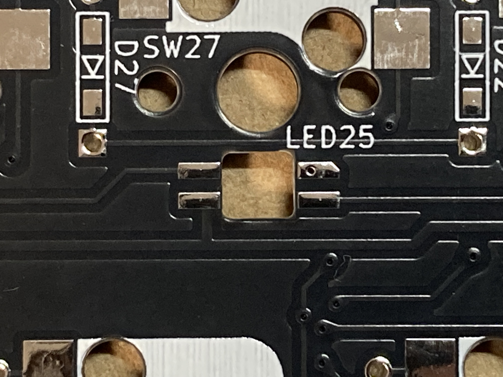
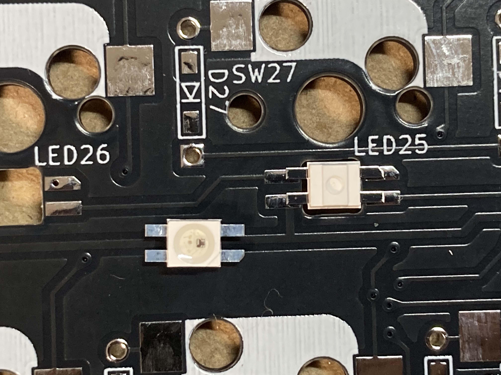
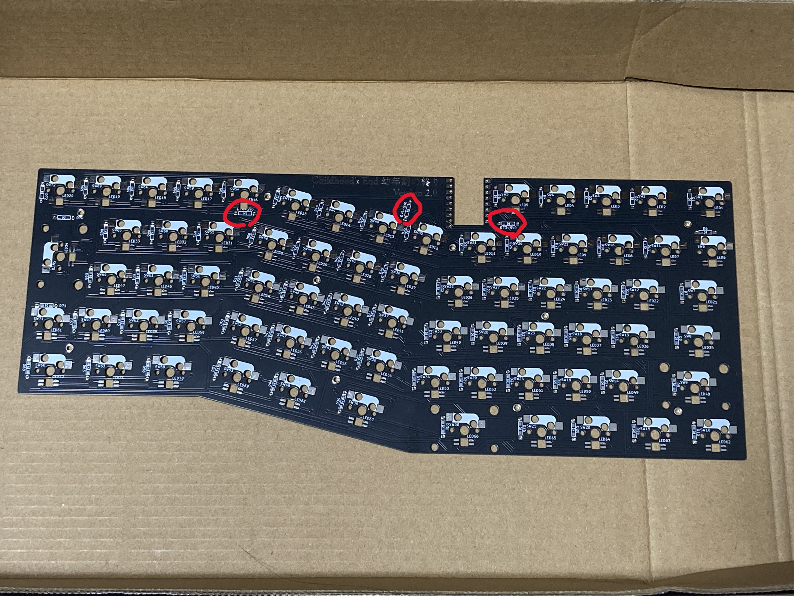
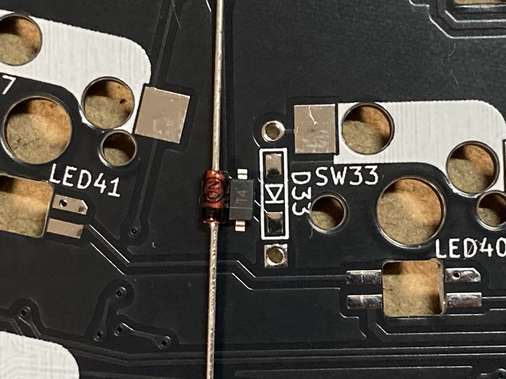
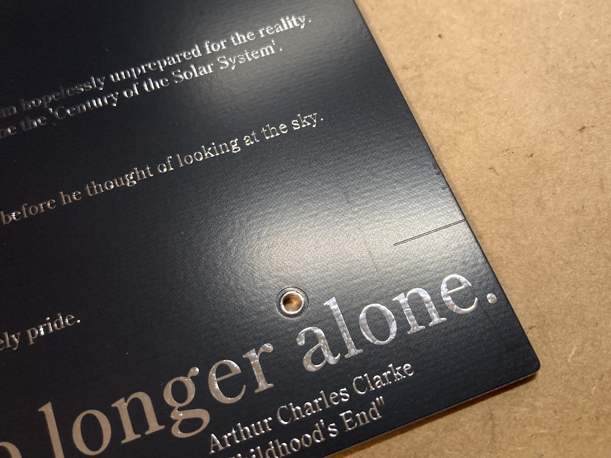

# Ver-2.0 ビルドガイド

## 作業前の準備
### 必須パーツ
販路やイベントにより販売時の内容は異なります。足りないものをそれぞれ揃えてください。
 - 基板
   1枚  
   「Childhood's End 幼年期の終り」と、バージョン情報が書き込まれた面が裏側となり、ほぼすべての作業をこちらの面に行います。  
    ビルドガイド内で左右を指定している場合、斜めに切断された辺が手前側となります。
 - スイッチプレート  
   1枚  
   裏表を判別するマーク等はありません。  
 - バックプレート  
   1枚  
   文字の書かれた面が表側(組み立て後は外側)となります。  
 - ゴム足  
   四角いゴム足が4つ入っています。
   傾斜を付けたい場合は適切なものを購入してください。  
 - ネジ  
   M2×3、M2×7を10本ずつ使用します。0番1種などの小型ネジだと綺麗に見えます。  
 - スペーサー  
   M2x2、M2×3.5を10本ずつ使用します。
 - 作業用ピンヘッダ  
   短いもので問題ありません。2本ほど必要です。  
 - Waveshare RP2040-Zero  
   1個必要です。
 - Cherry MX互換キースイッチ  
   72個
 - MX軸キーキャップ  
   1セット JIS配列推奨  
   ※「キーキャップの選定」参照
 - MXキーソケット  
   72個 Kailh製のものを想定しています。
 - ダイオード  
   72個 1N4148シリーズ 表面実装、リードどちらを使用しても構いません。
 - MX用 2Uスタビライザー  
   3個　PCBマウントタイプ

### LED実装時のオプションパーツ類
 - LED SK6812MINI-E  
   72個
 - ダイオード  
   3個 1N4148で問題ありません。販路によっては一般整流ダイオードが同梱されています。
 - コンスルー  
   LEDを実装する際は、通電確認に使うと楽です。実装に使用するわけではありません。
   
### 必須工具類
 - はんだ作業関連品一式  
 - USB TypeC通信用ケーブル  
### 推奨工具類
 - はんだ作業用マット  
   設計の都合ではんだ面の中にビア(導電のための貫通穴)を設けているため、稀にここを通って裏にフラックスが回る場合があります。  
   机を汚したくない場合は敷くといいでしょう。
 - ゲタ  
   便宜上ゲタと呼んでいますがスルーホールパーツなどを実装する際に基板の下に敷いて高さを稼ぎ、パーツの浮きを防ぐためのものです。  
   非導電性で厚さ3mmほどあればいいので、割りばしなどを折ったもので構いません。  
 - キープラー
 - 油性マーカー(黒)  
 - マスキングテープ  
### 必要ファイルのダウンロード
 - [childhood_s_end_vial.uf2](https://github.com/Cheena-gb/Childhood-s-End/tree/main/Firm)  
   ファームウェアです。バージョン情報の注記がある場合は、基本的に最新のものを利用してください。  
   ※稀に特殊な用途のファームウェアがあるので、使用前にビルドガイドを確認し、分からないものは使わないでください。  
 - [Vial](https://get.vial.today/)  
   キーマップを書き換えるためのソフトウェアです。  
   オンライン版でも問題なく利用できますが、ダウンロード版だと日本語、JISキーに対応していることと、マトリクスチェッカーの反応が早くて良いのでお勧めです。
  
## キーキャップの選定
以下の条件を満たすセットであれば主要なキーをカバーできます。  
 - 65%以上のセット  
 - JIS配列対応  
   
100%のキットであればほぼ完璧にカバー可能ですが、最下段のキー幅によっては個別購入が必要になります。  
なお、現行品では1.5u型のStepped Caps Lockは使用不可能です。1.75uの中央に軸があるものを使用してください。  

最下段の構成は以下の通りです。合わない場合は個別に購入してください。  
 - 1.25U Ctrl
 - 1.25U Win
 - 1.25U Alt
 - 1U 無変換
 - 2.25U Space
 - 1.75U Space
 - 1.25U 変換
 - 1.25U かな
 - 1.25U Alt
 - 1.25U Menu
 - 1.25U Ctrl
    
単品購入が必要だったり、移植する必要がある可能性の高いキーは以下の通りです。
 - 右ShiftおよびFn  
   1U @R2が必要です。同列のテンキーや矢印キー上を使用するか、ブランクを購入してください。  
 - Space  
   左側に2.25U @R1、右側に1.75U @R1を使用します。双方とも左右のShiftを移植することでぴったり合わせられます。  
 - 左Shift  
   2Uキーキャップを使用します。2U Shiftがない場合はテンキーの0を移植します。
  
その他のキーも足りない場合は適宜単品購入して合わせます。

[具体的なキー幅はKLEでも確認できます。](https://www.keyboard-layout-editor.com/##@@_y:2&x:2%3B&=%0AEsc%0A1&_x:0.5%3B&=%0AIns%0A2&=%0APrint%0A3&=%0AScLk%0A4&=%0APause%0A5&_x:5.75%3B&=%0A%2F=-%0A59&=%0A~%5E%0A64&=%0A%7C%5C%0A69&=%0ABS%0A72%3B&@_x:12.75%3B&=%0AP%0A55&=%0A%60%2F@%0A60&=%0A%7B%5B%0A65&_x:0.25&w:1.25&h:2&w2:1.5&h2:1&x2:-0.25%3B&=%0AEnter%0A70%0A%0A%0A%0A%0A%0A%0AISO%3B&@_y:-0.75&x:2%3B&=%0A%E5%8D%8A%2F%2F%E5%85%A8%0A6&=%0A1%0A11&=%0A2%0A16&=%0A3%0A21&=%0A4%0A26&=%0A5%0A31%3B&@_y:-0.25&x:13%3B&=%0A%2F%3B+%0A56&=%0A%2F:%0A61&=%0A%7D%5D%0A66%3B&@_y:-0.75&x:2&w:1.5%3B&=%0ATab%0A7%0A%0A%0A%0A%0A%0A%0A1.5&=%0AQ%0A12&=%0AW%0A17&=%0AE%0A22&=%0AR%0A27&=%0AT%0A32%3B&@_y:-0.25&x:13.25%3B&=%0A%3F%2F%2F%0A57&=%0A%2F_%5C%0A62&=%0AShiftR%0A67&=%0AFn%0A71%3B&@_y:-0.75&x:2&w:1.5&w2:1.75&l:true%3B&=%0ACaps%20Lock%0A8%0A%0A%0A%0A%0A%0A%0A1.75&_x:0.25%3B&=%0AA%0A13&=%0AS%0A18&=%0AD%0A23&=%0AF%0A28%0A%0A%0A%0A%0A%0A%0A%0A%2F_&=%0AG%0A33%3B&@_y:-0.25&x:13.5&w:1.25%3B&=%0AAltR%0A58%0A%0A%0A%0A%0A%0A%0A1.25&_w:1.25%3B&=%0AMenu%0A63%0A%0A%0A%0A%0A%0A%0A1.25&_w:1.25%3B&=%0ACtrlR%0A68%0A%0A%0A%0A%0A%0A%0A1.25%3B&@_y:-0.75&x:2&w:2%3B&=%0AShiftL%0A9%0A%0A%0A%0A%0A%0A%0A2&=%0AZ%0A14&=%0AX%0A19&=%0AC%0A24&=%0AV%0A29&=%0AB%0A34%3B&@_x:2&w:1.25%3B&=%0ACtrlL%0A10%0A%0A%0A%0A%0A%0A%0A1.25&_w:1.25%3B&=%0AWin%0A15%0A%0A%0A%0A%0A%0A%0A1.25&_w:1.25%3B&=%0AAltL%0A20%0A%0A%0A%0A%0A%0A%0A1.25&=%0A%E7%84%A1%E5%A4%89%E6%8F%9B%0A25&_w:2.25%3B&=%0A%0A30%0A%0A%0A%0A%0A%0A%0A2.25%3B&@_rx:12&ry:4.75&y:-2.75&x:0.25%3B&=%0A0%0A54%3B&@_r:-14.4&y:-0.75&x:-3.5%3B&=%0A6%0A35&=%0A7%0A40&=%0A8%0A44&=%0A9%0A49%3B&@_x:-3.25%3B&=%0AY%0A36&=%0AU%0A41&=%0AI%0A45&=%0AO%0A50%3B&@_x:-3.25%3B&=%0AH%0A37&=%0AJ%0A42%0A%0A%0A%0A%0A%0A%0A%0A%2F_&=%0AK%0A46&=%0AL%0A51%3B&@_x:-3.25%3B&=%0AN%0A38&=%0AM%0A43&=%0A%3C,%0A47&=%0A%3E.%0A52%3B&@_x:-3.5&w:1.75%3B&=%0A%0A39%0A%0A%0A%0A%0A%0A%0A1.75&_w:1.25%3B&=%0A%E5%A4%89%E6%8F%9B%0A48%0A%0A%0A%0A%0A%0A%0A1.25&_w:1.25%3B&=%0A%E3%82%AB%E3%81%B2%E3%83%AD%0A53%0A%0A%0A%0A%0A%0A%0A1.25)

## ファイルの確認
ファイル名末尾の **** の部分はバージョン情報です。基板のバージョンとファームウェアのバージョンには関連がありませんので、Ver.BETAを除いては特別な理由がない限り最新のものを使用してください。  
全て本リポジトリ内の/Firm以下で入手できます。
### childhood_s_end_vial.uf2
キーボードを制御するためのファームウェアです。  
**！！！.hexファイルはPro Micro用なので使用できません！！！**  
末尾に注記のないものはLEDマトリクスを使用しており、VialRGBによるライティングが楽しめます。  
末尾がNoRGBMのものはLEDマトリクスを実装していない分、容量がわずかに小さくなっています。  
マクロを大量に使用したい場合、マトリクスLEDではなく通常のLEDエフェクトが良い場合[^1]、そもそもLEDが不要な場合はこちらを選んでください。

[^1]:LEDを左上から横に流れるように配置しているため、Snakeなどのエフェクトは傾斜配置を強調するように綺麗に流れます。両方設定するとバグることがあるためファームを分離していますが、好みで選んで大丈夫です

### Vial
[Vial公式](https://get.vial.today/)からダウンロードできる、リアルタイムでキーボードの設定を変更できるソフトウェアです。  
日本語配列への表示変更が可能で認識の早いダウンロード版をおすすめしますが、Web版でも問題なく使用できます。  

## RP2040-Zeroの作業

### 動作確認
BOOTボタンを押しながらPCとRP2040-Zeroを接続し、ストレージとして認識されたらファームウェアをコピーします。  
書き込みが終わった段階でストレージとして認識されなくなり、かわりにHIDとして接続されるはずです。  
一旦書き込んだらVialの使用が可能になるので、Vialを起動し、キーボードが表示されていることを確認します。  

うまくいかない場合
  
通信用ケーブルで接続していることを確認してください。  
稀にPC側のポート自体が破損していてデータ通信が行えないこともあります。(一敗)  
 
  PCに接続してから「BOOTボタンを押しながら、RESETボタンを押す」という方法でも接続が可能です。  
   
  それでも認識しなかったり、書き込めない場合は初期不良かもしれません。

  

## はんだ前の作業

### 基板端の処理(任意)
尖った部分がある場合はヤスリで削ります。  
基板の端(断面)を油性マーカーで塗ると綺麗に見えます。  

### RP2040-Zeroの塗装(任意)
ボタン部と端子のある辺の基板端を黒く塗ると組み立てた後も目立たなくなります。  

### ロゴと文字の保護(任意)
基板のロゴ(星のマーク)と文字、ネジ穴ははんだ面で表示しているため、はんだやフラックスが付くと汚れてしまいます。  
心配な場合は、マスキングテープやカプトンテープを貼り付けておき、はんだ作業が終わった時点で剥がすといいでしょう。  

はんだ付いちゃった……
一応剥がす手段があります。  

- まず、付近のはんだ面含めてはんだを多めに盛る。 
- はんだ回収線を用いて全体を一気にクリーニングする。
- フラックスリムーバーやパーツクリーナーで汚れを洗浄する。

  HASLと異なり、はんだを吹き飛ばすことはないため、多少の凹凸は残ります。  
  製造段階では基本的に有鉛ハンダを使用しているため、この作業を行う際も有鉛ハンダをお勧めします。  
  流動性が良いので、回収しやすく凹凸が減り、なおかつ有鉛無鉛を混合することによる強度低下を抑えることができます。  

## 部品のはんだづけ
ここから先は大量のパーツをはんだづけすることになります。  
途中で休憩もできますが、一度にやってしまうのが楽でしょう。  

### LEDと周辺のはんだづけ(任意)
LEDをはめこむ穴のうち、角が欠けている部分がGNDとなり、LED側の足の角が欠けている部分を合わせると正しい方向になります。  

発光面は基板オモテ側を向くようになります。丸い透明な樹脂がはまっている面が発光面です。  
3か所あるD73-5V0にダイオードをはんだづけします。  

この際、1N4148シリーズを使用するなら基板ウラで問題ありませんが、1N4007など直径2mmを超えるリードダイオードに関しては基板オモテに実装してください。  

LEDが正しくはんだづけできているか不安…
コンスルーを使用するか、後述の方法でMCUをはんだづけして、LEDに通電してみてください。
  
問題なくはんだづけできれていれば、通電すると赤色に光るはずです。この状態でVialを起動し、Backlightingのタブから色やアニメーションを切り替えましょう。  

問題なく接続できているなら、なめらかに切り替わりますが、接続が不安定だと、その部分から先のLEDは不安定になります。

### トラブルシューティング(1)

LEDがすべて光らない
D73-5V0、L1、5V0、GND、GP29は問題なくはんだ付けできていますか？ケーブルは断線していませんか？
  

LEDが途中から光らない
光らないLED自体のはんだづけと、光らないLEDの直前のLEDのはんだを確認してください。D73-5V0の接続も確認してください。
  

それ以外の問題
製作者に連絡してください。

  
### ダイオードのはんだづけ
1N4148シリーズの使用を想定しています。**配線最適化と破損防止のため、向きを統一していません**  
シルクスクリーンとダイオードの向きを揃えてはんだづけしてください。矢印の向く方向にダイオード表面の線やマーカーが来ます。  

高さが2mmを超えるとバックプレートと干渉するため注意してください。また、シルクスクリーンの枠を外れるとスイッチソケットと干渉するおそれがあります。  
  
ダイオードのはんだづけに不安がある場合はここで導通確認を行います。  
MCUをコンスルーで接続するか、後述の方法ではんだ付けしてしまい、スイッチソケットのパッドにワイヤーやピンセットを当てて反応を確認してください。

### スイッチソケットのはんだづけ
シルクスクリーンとソケットの向きを揃えてはんだづけしてください。  
あまり大量にはんだを流すと端子部だけでなくソケット部にまで流れ込み、押し込みが硬くなったり、導通しなくなってしまうので注意してください。  
クリアランスを0.2mmほどに設定しているため、浮きがあるとバックパネルが取り付けられなくなります。基板に密着していることを確認しながらはんだづけしてください。

### RP2040-Zeroのはんだづけ
RP2040を基板のオモテ側に載せ、端子のある面がウラ側に向くようにします。  
この状態で付属のピンヘッダやコンスルーを突き刺し、RP2040が動かないようにして、ピンヘッダを刺している場所以外の端面スルーホールをはんだづけしていきます。  
ピンヘッダにははんだづけを行わず、RP2040が軽く固定できた時点で抜いて、残りの端面スルーホールもはんだづけしてください。  

実際に使っているピンはどれ？
マトリクススキャンはGP0～7、14、15、26～28、LED DOUTにGP29、LED用動力線の5V0、GNDです。
  
LEDを実装している場合、MCUに通電すれば赤色に発光するはずです。

### 導通確認
Matrix Testerを使用し、以下の方法のいずれかで基板の導通を確認します。  
- スイッチをはめ、押してみて反応を見る。
- はんだ付けしたソケットの脚にピンセットやワイヤーをあてて導通させる。  
  
すべてのキーが間違いなく反応している状態であれば問題ありません。  
そうでない場合、トラブルシューティング(2)を確認して対応してください。

### トラブルシューティング(2)

キーが反応しない・別のキーが反応する(1個単位)
ダイオードの方向、ソケットのはんだを確認してください。スイッチ自体の導通も見ましょう。  
  
※はんだ部分はヤニでコーティングされるため、ピンセットを強く押し当てないと通電しないことがあります

  

行・列単位でキーが反応しない
RP2040のはんだ不良を疑います。ピンとパッドが問題なく接続されていること、周辺のパッドと短絡していないことを確認してください。
  

別のキーが反応する
RP2040周辺の短絡を疑います。はんだが多すぎる場合は回収してください。

それ以外の問題
製作者に連絡してください。

## 組み立て
### スタビライザーの静音化(任意)
スタビライザーを分解して摺動部とワイヤーの端をたっぷりのグリスでコーティングします。  
スタビライザーの足元(穴と穴のあいだ)に静音パッドを貼ります。ない場合はマスキングテープや不織布テープ、絆創膏の粘着部を切って貼ります。  
テープの枚数は基板との隙間によりけり。多すぎると固定用の爪が噛まなくなるので適度にゲタを履かせましょう。  

### スタビライザーの取付け
ワイヤーが露出する部分は基板上に線で表示されています。  

### 組み付け
最初にキーボード自体を組み立てます。バックプレート表側から7mmネジを通し、2mmスペーサーで固定してください。  
レンチなどがある場合はここでしっかりと締め付けます。  
飛び出したネジに基板を重ね、3.5mmスペーサーで固定します。こちらもしっかり締めるようにしてください。  
スイッチプレートを重ね、3mmネジで固定します。  
平頭や黒色など、装飾性の高いネジが同梱されていた場合、Escキーの右下、水平部と傾斜部の接続部分の2か所、の合計3か所にそのネジを使い、それ以外には細いネジを使用するようにしてください。  
この状態でスイッチを挿入していきます。  
ゴム足はバックプレート四隅の文字が避けている部分に貼り付けてください。

# マッピングガイド
キーマップの書き換えにはVialを使用します。ダウンロード版の方は日本語配列にも対応しており、マトリクステスターの反応も早いため使いやすいと思います。  

## 初期状態
デフォルトで設定されているのはJIS配列を踏襲した配置となっており、通常のJISキーボードからの移行でも違和感なく使用できるはずです。  

Fnキーを押したときの挙動はレイヤーとして扱っています。初期状態では1から^までのキーにF1からF12を割り振り、さらにBackspaceにDeleteを設定している状態です。  
左上のエリア、Esc以外の4キーは初期状態では空となっています。LEDの制御やマクロなどに使用してください。  

## 書き換え
キーボードをPCに接続し、Vialを起動し、表示されたキーから変更したいものを選ぶ→画面下のリストからキーコードを選ぶ  
という手順で書き換えが可能です。  
詳細な使用方法はVialの公式ドキュメントなどを参照してください。

# カスタムガイド
## おすすめキースイッチ
安価かつ軽量なサンドイッチ構造と、高い剛性を両立しています。  
場所による癖が少なく、全体に亘って硬めの打鍵感となっているため、スイッチ自体の打鍵感が柔らかいサイレントスイッチなどとの相性が良くなっています。  
## おすすめキーキャップ
Acid Capsシリーズを使用するとほとんどのレジェンドを合わせることができます。  
論理配列は通常の65%JISキーボードに近いため、手が覚えているなら無刻印キーキャップでも問題なく使用可能かと思います。  
現行品ではキーソケットの方向を正方向に揃えているため、CherryプロファイルとMXスイッチの組み合わせでも干渉しません。  
LEDは下側にあるため、Double Shot Backlit系キーキャップは落ち着いた光り方になります(とはいえ、わりと爆光です。)。  
## フォームシート等について
スイッチプレート、基板、バックパネルの距離をスペーサーで厳密に固定しているため、フォームシートを利用しても効果が感じづらい可能性があります。  
なお、ソケットやダイオードなどに合わせて穴を開けたタイプのフォームシートに対応する予定は現状ありません。ご了承ください。
## ゴム足で傾斜を付ける場合の調整
バックプレートの一部に線状の表示を設けています(右端、"The human race was no longer alone."のすぐ上)。  

この位置にゴム足の下端を合わせるようにすると、左下のゴム足と水平に配置することができます。
角度を付けたい場合はこの表示を利用するとがたつかないように配置できます。  
なお、あまりにも傾斜をつけすぎるとキーボード下端が机と接触することがあります。

## ファームウェアの改造
[ここにあります。](https://github.com/Cheena-gb/vial-qmk/tree/vial/keyboards/cheena/childhood_s_end_v1)  
改造ファームの不具合、それに起因する故障などについてはサポートできませんのでご了承ください。  
また、DefaultとVIA用のキーマップには作業を行っていないため動きません。
