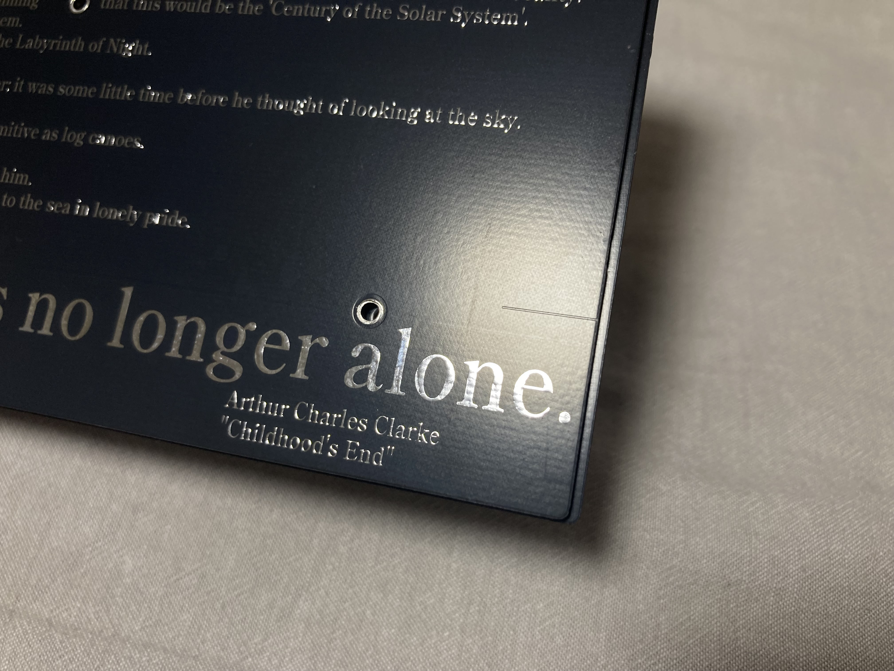

# 量産版　組み立て済み販売用ガイド
## 使用前の準備と確認
締結力を強化するため、基板とバックパネルを繋ぐ2mmスペーサーは「ネジなし」の物を採用しています。  
分解する際は、スイッチプレートのネジを抜き、3.5mmスペーサーを外すことでパーツの脱落を抑えることができます。  
再組み立て時には、マスキングテープ等で7mmネジを仮止めしておき、裏返して2mmスペーサー、基板、3.5mmスペーサーを重ねて固定するようにしてください。  
  
ゴム足には高品質なタカチ製のものを使用しています。バックプレートの4つの角に貼り付けるか(文字がちょうど避けるようになっています)、角度を付けたい際は適当なものを貼り付けて対応してください。  

"Human race was no longer alone."のすぐ右上あたりに薄く横線が入っています。  
この線は左側の高さと揃える位置にあるため、この線をゴム足の下側に合わせるとがたつかないようにすることができます。

## キーキャップの選定
以下の条件を満たすセットであれば主要なキーをカバーできます。  
 - 65%以上のセット  
 - JIS配列対応  
   
100%のキットであればほぼ完璧にカバー可能ですが、最下段のキー幅によっては個別購入が必要になります。  
なお、現行品では1.5u型のStepped Caps Lockは使用不可能です。1.75uの中央に軸があるものを使用してください。  

最下段の構成は以下の通りです(キーの割り振りは初期ファームウェアのものです)。合わない場合は個別に購入してください。  
 - 1.25U Ctrl
 - 1.25U Win
 - 1.25U Alt
 - 1U 無変換
 - 2.25U Space
 - 1.75U Space
 - 1.25U 変換
 - 1.25U かな
 - 1.25U Alt
 - 1.25U Menu
 - 1.25U Ctrl
    
単品購入が必要だったり、移植する必要がある可能性の高いキーは以下の通りです。
 - 右ShiftおよびFn  
   1U @R2が必要です。同列のテンキーや矢印キー上を使用するか、ブランクを購入してください。  
 - Space  
   左側に2.25U @R1、右側に1.75U @R1を使用します。双方とも左右のShiftを移植することでぴったり合わせられます。  
 - 左Shift  
   2Uキーキャップを使用します。2U Shiftがない場合はテンキーの0を移植します。
  
その他のキーも足りない場合は適宜単品購入して合わせます。

[具体的なキー幅はKLEでも確認できます。](https://www.keyboard-layout-editor.com/##@@_y:2&x:2%3B&=%0AEsc%0A1&_x:0.5%3B&=%0AIns%0A2&=%0APrint%0A3&=%0AScLk%0A4&=%0APause%0A5&_x:5.75%3B&=%0A%2F=-%0A59&=%0A~%5E%0A64&=%0A%7C%5C%0A69&=%0ABS%0A72%3B&@_x:12.75%3B&=%0AP%0A55&=%0A%60%2F@%0A60&=%0A%7B%5B%0A65&_x:0.25&w:1.25&h:2&w2:1.5&h2:1&x2:-0.25%3B&=%0AEnter%0A70%0A%0A%0A%0A%0A%0A%0AISO%3B&@_y:-0.75&x:2%3B&=%0A%E5%8D%8A%2F%2F%E5%85%A8%0A6&=%0A1%0A11&=%0A2%0A16&=%0A3%0A21&=%0A4%0A26&=%0A5%0A31%3B&@_y:-0.25&x:13%3B&=%0A%2F%3B+%0A56&=%0A%2F:%0A61&=%0A%7D%5D%0A66%3B&@_y:-0.75&x:2&w:1.5%3B&=%0ATab%0A7%0A%0A%0A%0A%0A%0A%0A1.5&=%0AQ%0A12&=%0AW%0A17&=%0AE%0A22&=%0AR%0A27&=%0AT%0A32%3B&@_y:-0.25&x:13.25%3B&=%0A%3F%2F%2F%0A57&=%0A%2F_%5C%0A62&=%0AShiftR%0A67&=%0AFn%0A71%3B&@_y:-0.75&x:2&w:1.5&w2:1.75&l:true%3B&=%0ACaps%20Lock%0A8%0A%0A%0A%0A%0A%0A%0A1.75&_x:0.25%3B&=%0AA%0A13&=%0AS%0A18&=%0AD%0A23&=%0AF%0A28%0A%0A%0A%0A%0A%0A%0A%0A%2F_&=%0AG%0A33%3B&@_y:-0.25&x:13.5&w:1.25%3B&=%0AAltR%0A58%0A%0A%0A%0A%0A%0A%0A1.25&_w:1.25%3B&=%0AMenu%0A63%0A%0A%0A%0A%0A%0A%0A1.25&_w:1.25%3B&=%0ACtrlR%0A68%0A%0A%0A%0A%0A%0A%0A1.25%3B&@_y:-0.75&x:2&w:2%3B&=%0AShiftL%0A9%0A%0A%0A%0A%0A%0A%0A2&=%0AZ%0A14&=%0AX%0A19&=%0AC%0A24&=%0AV%0A29&=%0AB%0A34%3B&@_x:2&w:1.25%3B&=%0ACtrlL%0A10%0A%0A%0A%0A%0A%0A%0A1.25&_w:1.25%3B&=%0AWin%0A15%0A%0A%0A%0A%0A%0A%0A1.25&_w:1.25%3B&=%0AAltL%0A20%0A%0A%0A%0A%0A%0A%0A1.25&=%0A%E7%84%A1%E5%A4%89%E6%8F%9B%0A25&_w:2.25%3B&=%0A%0A30%0A%0A%0A%0A%0A%0A%0A2.25%3B&@_rx:12&ry:4.75&y:-2.75&x:0.25%3B&=%0A0%0A54%3B&@_r:-14.4&y:-0.75&x:-3.5%3B&=%0A6%0A35&=%0A7%0A40&=%0A8%0A44&=%0A9%0A49%3B&@_x:-3.25%3B&=%0AY%0A36&=%0AU%0A41&=%0AI%0A45&=%0AO%0A50%3B&@_x:-3.25%3B&=%0AH%0A37&=%0AJ%0A42%0A%0A%0A%0A%0A%0A%0A%0A%2F_&=%0AK%0A46&=%0AL%0A51%3B&@_x:-3.25%3B&=%0AN%0A38&=%0AM%0A43&=%0A%3C,%0A47&=%0A%3E.%0A52%3B&@_x:-3.5&w:1.75%3B&=%0A%0A39%0A%0A%0A%0A%0A%0A%0A1.75&_w:1.25%3B&=%0A%E5%A4%89%E6%8F%9B%0A48%0A%0A%0A%0A%0A%0A%0A1.25&_w:1.25%3B&=%0A%E3%82%AB%E3%81%B2%E3%83%AD%0A53%0A%0A%0A%0A%0A%0A%0A1.25)
